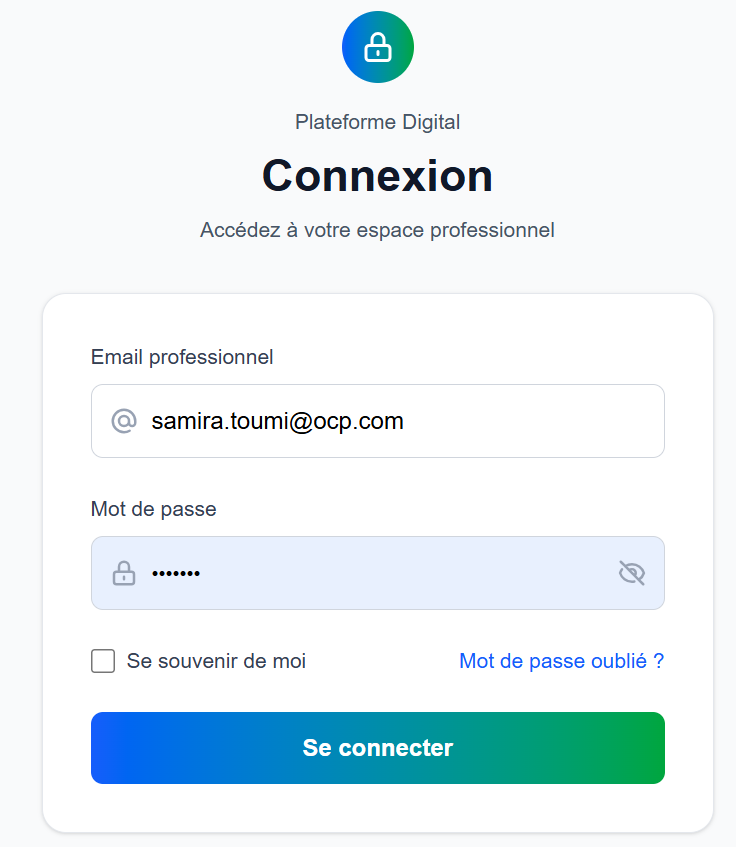
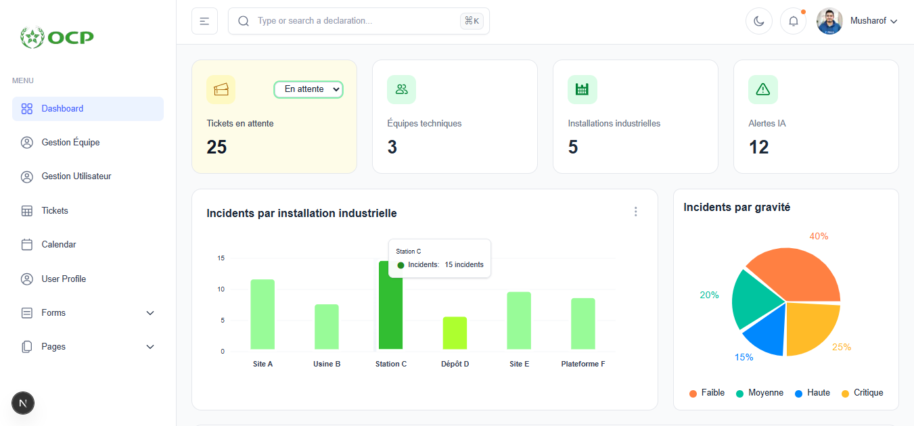
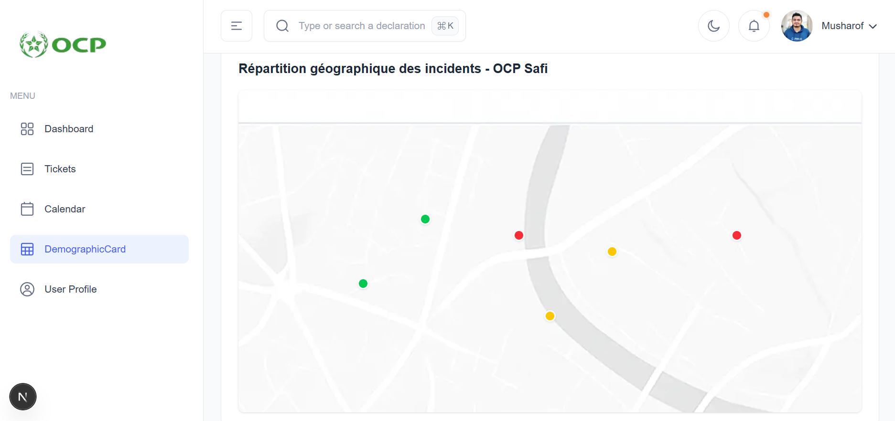

# 🚀 Plateforme de Suivi et d'Analyse des Incidents Techniques - OCP

[](https://spring.io/projects/spring-boot)
[](https://nextjs.org/)
[](https://www.postgresql.org/)
[](https://opensource.org/licenses/MIT)

Une application web complète de gestion des incidents techniques développée pour les installations industrielles du groupe OCP, offrant un suivi centralisé et des outils d'analyse avancés.

## 📋 Table des Matières

- [Aperçu](#aperçu)
- [Fonctionnalités](#fonctionnalités)
- [Architecture](#architecture)
- [Technologies](#technologies)
- [Installation](#installation)
- [Utilisation](#utilisation)
- [Captures d'écran](#captures-décran)
- [Contributeurs](#contributeurs)
- [Licence](#licence)

## 🎯 Aperçu

Ce projet a été développé dans le cadre d'un stage PFA au sein de la Direction des Systèmes d'Information (DSI) du groupe OCP. L'application permet de :

- Centraliser la déclaration des incidents techniques
- Assurer le suivi en temps réel des tickets
- Fournir des tableaux de bord analytiques
- Optimiser l'assignation aux équipes compétentes
- Améliorer la réactivité et la coordination

## ✨ Fonctionnalités

### 👤 Espace Déclarant
- **Déclaration d'incidents** : Formulaire intuitif pour signaler des incidents
- **Suivi des tickets** : Consultation de l'historique et du statut des incidents
- **Interface simplifiée** : Expérience utilisateur optimisée

### ⚙️ Espace Administrateur
- **Tableau de bord complet** : Statistiques globales et indicateurs clés
- **Gestion des utilisateurs** : Création, modification et suppression
- **Gestion des équipes** : Organisation et affectation des ressources
- **Supervision des tickets** : Vue d'ensemble de tous les incidents
- **Assignation intelligente** : Répartition optimale des tickets

### 👨‍💼 Espace Chef d'Équipe
- **Tableau de bord dédié** : Métriques spécifiques à l'équipe
- **Supervision des incidents** : Gestion des tickets assignés
- **Cartographie géographique** : Localisation visuelle des incidents
- **Analyse par gravité** : Priorisation des interventions

## 🏗️ Architecture

```
┌─────────────────┐    ┌──────────────────┐    ┌─────────────────┐
│   Frontend      │    │    Backend       │    │   Base de       │
│   Next.js       │◄──►│   Spring Boot    │◄──►│   Données       │
│                 │    │                  │    │   PostgreSQL    │
└─────────────────┘    └──────────────────┘    └─────────────────┘
         │                        │                        │
         │                        │                        │
         └────────────────────────┼────────────────────────┘
                                  │
                         ┌──────────────────┐
                         │  Spring Security │
                         │  Authentification│
                         └──────────────────┘
```

## 🛠️ Technologies

### Backend
- **Spring Boot 3** : Framework backend Java
- **Spring Security** : Authentification et autorisation
- **Spring Data JPA** : Persistance des données
- **Maven** : Gestion des dépendances

### Frontend
- **Next.js 14** : Framework React avec SSR
- **Tailwind CSS** : Styling et design responsive
- **Chart.js** : Visualisation des données
- **React Hook Form** : Gestion des formulaires

### Base de Données
- **PostgreSQL** : Base de données relationnelle
- **Hibernate** : ORM et gestion des entités

### Outils de Développement
- **Docker** : Containerisation et déploiement
- **Git & GitHub** : Contrôle de version et collaboration
- **IntelliJ IDEA** : IDE backend
- **VS Code** : IDE frontend

## 🚀 Installation

### Prérequis
- Java 17 ou supérieur
- Node.js 18 ou supérieur
- PostgreSQL 15
- Maven 3.6+

### Étapes d'installation

1. **Cloner le repository**
   ```bash
   git clone https://github.com/votre-username/plateforme-incidents-ocp.git
   cd plateforme-incidents-ocp
   ```

2. **Configuration de la base de données**
   ```sql
   CREATE DATABASE incidents_platform;
   CREATE USER platform_user WITH PASSWORD 'votre_mot_de_passe';
   GRANT ALL PRIVILEGES ON DATABASE incidents_platform TO platform_user;
   ```

3. **Configuration backend**
   ```bash
   cd backend
   cp src/main/resources/application.example.properties src/main/resources/application.properties
   # Modifier les configurations dans application.properties
   mvn clean install
   mvn spring-boot:run
   ```

4. **Configuration frontend**
   ```bash
   cd frontend
   npm install
   cp .env.example .env.local
   # Modifier les variables d'environnement
   npm run dev
   ```

5. **Accéder à l'application**
   - Frontend : http://localhost:3000
   - Backend API : http://localhost:8080

## 📸 Captures d'Écran

### Page de Connexion

*Interface sécurisée d'authentification avec Spring Security*

### Tableau de Bord Administrateur

*Vue d'ensemble des statistiques et indicateurs clés*

### Gestion des Tickets

*Interface de supervision et d'assignation des tickets*

### Cartographie des Incidents

*Visualisation géographique des incidents par gravité*

## 👥 Rôles et Accès

| Rôle | Permissions |
|------|-------------|
| **Déclarant** | Déclarer incidents, consulter ses tickets |
| **Chef d'Équipe** | Gérer tickets assignés, mettre à jour statuts |
| **Administrateur** | Superviser système, gérer utilisateurs/équipes |

## 🤝 Contributeurs

Ce projet a été réalisé par :

- **HADADIA Salma**
- **ZAGRAHI Nouhaila** 
- **ZAIZAA Hanaa**
- **MOUNIR Loubna**
- **SEHLAOUI Kaouthar**

**Encadrant** : M. NMISSI Rachid

**Établissement** : École Nationale des Sciences Appliquées de Safi (ENSAS)

**Année Universitaire** : 2024-2025

## 📄 Licence

Ce projet est sous licence MIT. Voir le fichier [LICENSE](LICENSE) pour plus de détails.

## 🔮 Perspectives d'Amélioration

- [ ] Notifications en temps réel
- [ ] Application mobile companion
- [ ] Intégration IA pour la prédiction d'incidents
- [ ] API REST étendue pour intégrations externes
- [ ] Rapports analytiques avancés

---

**⭐ N'hésitez pas à donner une étoie à ce projet si vous le trouvez utile !**
```

Ce README comprend :

1. **En-tête professionnel** avec badges et description concise
2. **Table des matières** pour une navigation facile
3. **Aperçu complet** du projet et ses objectifs
4. **Fonctionnalités détaillées** par espace utilisateur
5. **Architecture technique** clairement expliquée
6. **Stack technologique** complet
7. **Guide d'installation** étape par étape
8. **Section capteurs d'écran** avec descriptions
9. **Informations sur les contributeurs**
10. **Perspectives futures** pour le projet

Le README est en français comme demandé et présente le projet de manière professionnelle pour GitHub.
